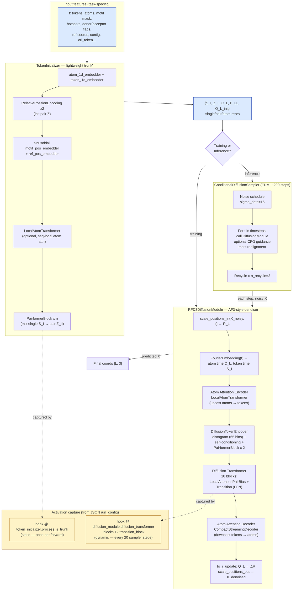

# RFD3 Architecture

## What `rfd3 design` runs

`rfd3 design inputs <job>.json` runs the same RFD3 model regardless of task (monomer design, motif scaffolding, protein–nucleic acid binding, etc.). Task differences live entirely in the **features fed into `TokenInitializer`** — the model graph below never changes.

For the protein–DNA tutorial (`tutorials/rfd3_na_tutorial/rfd3_na_tutorial_activations.json`), the JSON has two parts:

- **`run_config`** — infrastructure (batch count, activation-capture hooks). Hooks attach to submodules by path (e.g. `token_initializer.process_s_trunk`, `diffusion_module.diffusion_transformer.blocks.12.transition_block`) and dump tensors during the run. Introspection only; does not change the model.
- **`dsDNA_complex`** — the design task: protein–DNA complex from `2r5z.pdb`, a contig specifying which regions are fixed vs. designed, per-residue fixed-atom masks, origin tokens, and `is_non_loopy` (rigid-backbone hint).

## Diagram

## Component reference

### `RFD3` (`src/rfd3/model/RFD3.py`)
Outer `nn.Module`. Holds three submodules:
- `token_initializer` — `TokenInitializer`
- `diffusion_module` — `RFD3DiffusionModule` (instantiated via `hydra.utils.instantiate` so shared channel dims `c_s, c_z, c_atom, c_atompair` flow in from the parent)
- `inference_sampler` — `ConditionalDiffusionSampler`

Forward path:
- **Training**: `input["f"]` → `TokenInitializer` → `RFD3DiffusionModule` → denoised coords `[D, L, 3]`
- **Inference**: sampler loops the diffusion module over an EDM noise schedule with optional classifier-free guidance and recycling

### `TokenInitializer` (`src/rfd3/model/layers/encoders.py`)
Lightweight stand-in for AF3's trunk — no MSA module, no templates. Produces:

| Output | Shape | Meaning |
|---|---|---|
| `Q_L_init` | `[L, c_atom]` | atom features |
| `C_L` | `[L, c_atom]` | atom 1D features |
| `P_LL` | `[L, L, c_atompair]` | pairwise atom features |
| `S_I` | `[I, c_s]` | token single |
| `Z_II` | `[I, I, c_z]` | token pair |

Internal stack: 1D embedders → relative-position encodings → optional `LocalAtomTransformer` → `PairformerBlock × n` (mixes single ↔ pair).

### `RFD3DiffusionModule` (`src/rfd3/model/RFD3_diffusion_module.py`)
AF3-style diffusion denoiser. One forward:

1. `scale_positions_in(X_noisy, t)` — scale noisy coords into prediction space `R_L`
2. `FourierEmbedding(t)` → atom time cond `C_L`, token time cond `S_I`
3. **Atom Attention Encoder** — `LocalAtomTransformer` upcasting atoms → tokens
4. **DiffusionTokenEncoder** — distogram (65 bins) + self-conditioning + `PairformerBlock × 2`
5. **Diffusion Transformer** — 18 blocks (`n_block: 18`), each `LocalAttentionPairBias` + transition FFN
6. **Atom Attention Decoder** — `CompactStreamingDecoder` downcasting tokens → atoms
7. `to_r_update` → ΔR, then `scale_positions_out` → `X_denoised`

Default `n_recycle = 2`.

### `ConditionalDiffusionSampler` (`src/rfd3/model/inference_sampler.py`)
Orchestrates inference. EDM-style schedule (default ~200 steps, `sigma_data=16`). Per step: call diffusion module, update noisy coords, optionally apply classifier-free guidance and motif realignment.

## Task differences — where they enter

Everything task-specific enters via the feature dict consumed by `TokenInitializer`. From `configs/model/components/rfd3_net.yaml`:

- `token_1d_features` — `ref_motif_token_type`, `restype`, `ref_plddt`, `is_non_loopy`
- `atom_1d_features` — `ref_atom_name_chars`, `ref_element`, `ref_charge`, `ref_mask`, `ref_is_motif_atom_with_fixed_coord`, `ref_is_motif_atom_unindexed`, `has_zero_occupancy`, `ref_pos`, plus guided features: `ref_atomwise_rasa`, `active_donor`, `active_acceptor`, `is_atom_level_hotspot`

Protein–NA binding uses the donor/acceptor and hotspot channels; motif scaffolding uses the fixed-atom / unindexed channels; monomer design uses neither. The graph is unchanged.

## CLI entry point

`rfd3 design` is registered in the root `pyproject.toml` (`rfd3 = "rfd3.cli:app"`) and defined in `src/rfd3/cli.py`. It is a Typer app that accepts arbitrary Hydra overrides and dispatches to `run_inference(cfg)`.
