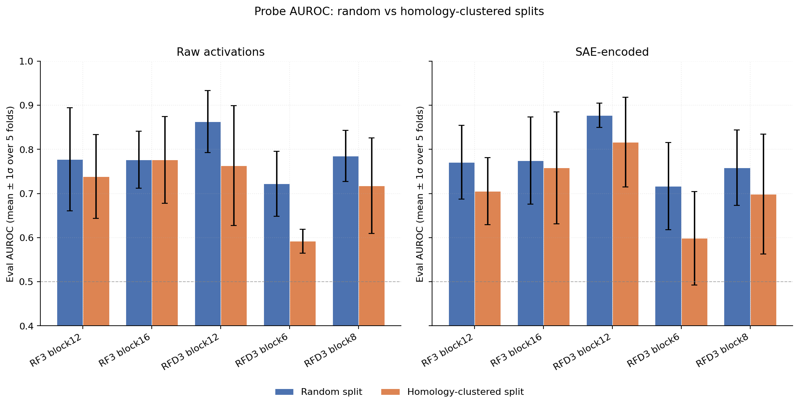
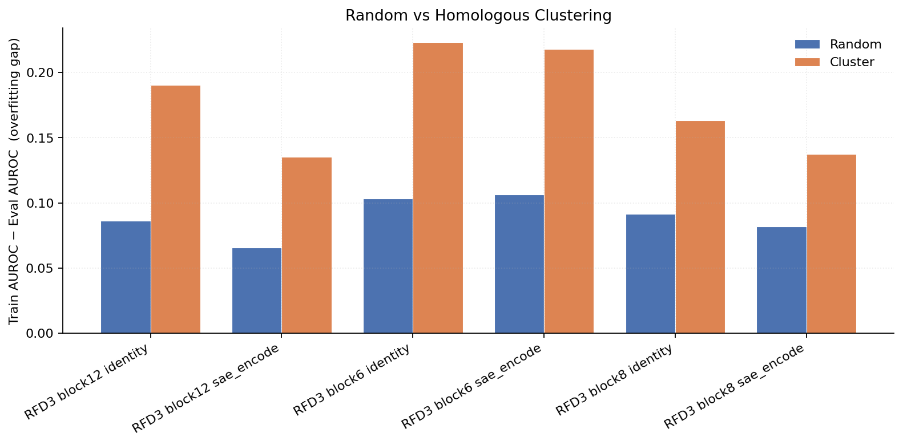
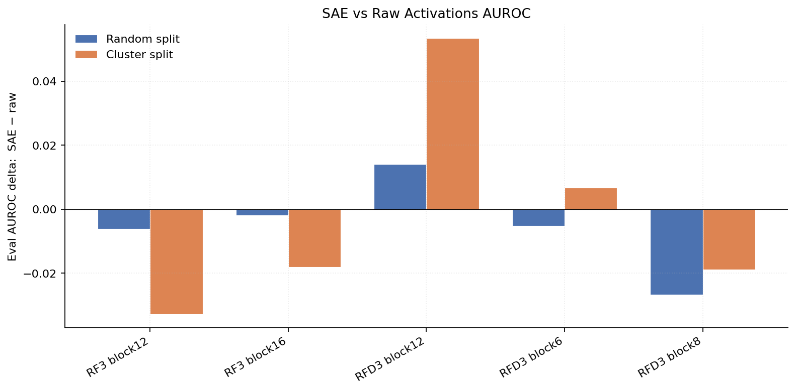
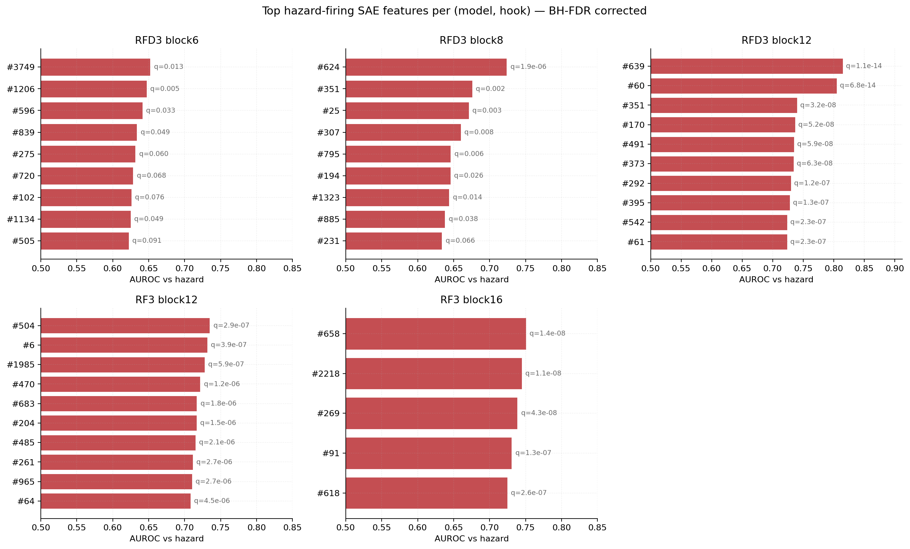

# Classifier sweep — two-variant story

This is the cleaned-up writeup using only the two variants where hyperparameters are matched. Random vs homology-clustered split is the only thing that changes between them, so the comparison is honest.

- **random** = 5-fold stratified random split, weight_decay 1e-2, 75 epochs, `select_top_k=50` symmetric across extractors (`results_stop_overfitting/`).
- **cluster** = 5-fold homology-clustered split (mmseqs2 easy-cluster, 30% identity), all other hyperparameters identical to `random` (`results_cluster_stop_overfit/`).

All results are 5-fold CV mean ± std on the SafeProtein/UniProt cells (n=275, 165 hazards / 110 benigns; 220 train / 55 test per fold). RF3 ToxinPred3 cells were broken by an h5/labels mismatch under k-fold and are omitted.

---

## Headline

**Best honest number: RFD3 block12 SAE = 0.817 ± 0.10 under homology-clustered splits.** This is the AUROC to quote for any external claim. The matching random-split number (0.877 ± 0.03) is what the model can do when paralog leakage is allowed.



---

## Two findings that the matched comparison makes clean

### 1. Homology clustering costs ~0.10 AUROC on RFD3, near zero on RF3

| cell | random | cluster | Δ |
|---|---|---|---|
| rfd3 block6 identity | 0.722 | 0.592 | **−0.130** |
| rfd3 block6 sae_encode | 0.717 | 0.599 | **−0.118** |
| rfd3 block8 identity | 0.785 | 0.718 | −0.067 |
| rfd3 block12 identity | 0.863 | 0.763 | **−0.100** |
| rfd3 block12 sae_encode | 0.877 | 0.817 | −0.060 |
| rf3 block12 identity | 0.777 | 0.738 | −0.039 |
| rf3 block16 identity | 0.776 | 0.776 | 0.000 |
| rf3 block16 sae_encode | 0.774 | 0.758 | −0.016 |

RFD3 representations were memorizing fold families. RF3 (sequence-only conditioning) wasn't. Block6 raw collapses to 0.59 under clustering, basically chance.

The train-eval gap chart shows the same story from the other angle: clustering exposes the overfitting that random splits hide.



### 2. SAE wins on RFD3 block12 (the strongest cell), and the gap grows under cluster

Across the sweep, only RFD3 block12 shows SAE solidly beating raw. The SAE advantage *grows* under homology-clustered splits (+0.014 random → +0.054 cluster). For the other four cells, raw activations match or slightly beat SAE under both split types.



| cell | identity | sae_encode | SAE − raw under cluster |
|---|---|---|---|
| **rfd3 block12** | 0.763 | 0.817 | **+0.054** SAE wins |
| rfd3 block6 | 0.592 | 0.599 | +0.007 (within noise) |
| rfd3 block8 | 0.718 | 0.699 | −0.019 raw wins |
| rf3 block16 | 0.776 | 0.758 | −0.018 raw wins |
| rf3 block12 | 0.738 | 0.706 | −0.032 raw wins |

So the SAE-vs-raw story isn't a clean "SAE generalizes better" claim. The honest read is: where SAE wins, it wins more when generalization is harder. This is consistent with the SAE filtering out family-specific noise that raw activations rely on, but only at a layer that already carries clean toxicity-relevant signal. At earlier or shallower layers, neither representation has enough discriminative structure for the SAE bottleneck to help.

---

## RFD3 vs RF3 honest assessment

| variant | RF3 best | RFD3 best | gap | within noise? |
|---|---|---|---|---|
| random | 0.777 | 0.877 | RFD3 +0.100 | borderline (σ ≈ 0.07) |
| cluster | 0.776 | 0.817 | RFD3 +0.041 | **yes** (σ ≈ 0.10) |

Under proper homology splitting RFD3 ≈ RF3 within error bars. The +0.10 gap on the random split was inflated by paralog leakage.

---

## Q1 full table (5-fold mean ± std, SafeProtein cells only)

| dataset | hook | extractor | random eval AUROC | cluster eval AUROC |
|---|---|---|---|---|
| rf3_safeprotein | block12 | identity | 0.777 ± 0.117 | 0.738 ± 0.095 |
| rf3_safeprotein | block12 | sae_encode | 0.771 ± 0.084 | 0.706 ± 0.076 |
| rf3_safeprotein | block16 | identity | 0.776 ± 0.064 | 0.776 ± 0.098 |
| rf3_safeprotein | block16 | sae_encode | 0.774 ± 0.099 | 0.758 ± 0.127 |
| rfd3_safeprotein | block6 | identity | 0.722 ± 0.074 | 0.592 ± 0.027 |
| rfd3_safeprotein | block6 | sae_encode | 0.717 ± 0.099 | 0.599 ± 0.106 |
| rfd3_safeprotein | block8 | identity | 0.785 ± 0.058 | 0.718 ± 0.108 |
| rfd3_safeprotein | block8 | sae_encode | 0.759 ± 0.085 | 0.699 ± 0.136 |
| rfd3_safeprotein | block12 | identity | **0.863 ± 0.070** | 0.763 ± 0.136 |
| rfd3_safeprotein | block12 | sae_encode | **0.877 ± 0.028** | **0.817 ± 0.102** |

---

## Q2 — Top hazard-firing SAE features (RFD3, BH-FDR corrected)

Univariate AUROC per SAE feature against the full labels CSV; top-200 get exact Mann-Whitney U p-values, BH q-values across all non-constant dictionary features:

```
hook     active_features  q<0.05  q<0.01  top |AUROC-0.5|
block6     11468/12288       37       7      0.256 (#47, fires-on-benign)
block8     12017/12288       26      11      0.276 (#624, fires-on-hazard)
block12    12279/12288      200     195      0.315 (#639, fires-on-hazard)
```



**Block12 #639** (AUROC 0.815, q ~ 0, fires on 272/275 designs) is the strongest single-feature hazard correlate. Its top firing design is `train_inputs_hazard_P00626_0` (UniProt P00626, snake-venom phospholipase A2). The feature concentrates on residues 70, 83, 99, 104, 109 of chain A — the catalytic and membrane-binding region of the PLA2 fold. Plausibly biologically meaningful, not random. Renderings of this and other top features are at `outputs/classifiers/viz/rfd3_safeprotein_block{6,8,12}/*.png`.

Pattern by depth: block6 dominated by `fires-on-benign` features (early-layer features capture general protein-likeness, hazards fire fewer of them); block8 mixed; block12 has the cleanest hazard-vs-benign separation and is the layer to target for both probing and steering.

---

## Sanity checks

- **Length-only baseline:** AUROC 0.554 (random split, n=55 test). The headline 0.82+ is not driven by length.
- **SAE health (`sae_health_check.py`):** all five SAEs healthy. l0 ≈ 80 (matches k), `frac_alive ≥ 0.94`, FVE ≥ 96%, cossim ≥ 98%. The earlier "1% feature utilization" was a pool-then-encode bug that we fixed in `detectors/pipelines/cache.py`.

---

## Caveats

1. **n_test ≈ 55 per fold.** Even averaged across 5 folds, AUROC gaps under 0.05 are within noise.
2. **Single SAE seed.** No error bars from re-training the SAE itself.
3. **No PFAM/InterPro family breakdown.** Would tell us whether the classifier generalizes to novel toxin families or just recognizes common ones.
4. **The 2D-per-step hooks** (`token_initializer_outputs`, `to_si`) were skipped because `pool_design` requires 4D. A one-line `np.expand_dims` patch would unlock them.

---

## Files

| What | Path |
|---|---|
| Probe table (random) | `results_stop_overfitting/probes.{csv,md}` |
| Probe table (cluster) | `results_cluster_stop_overfit/probes.{csv,md}` |
| Per-fold raw rows | `results_*/probes_per_fold.csv` |
| Top features per cell | `results/top_features.{csv,md}` |
| Figures | `results_cluster_stop_overfit/figures/*.png` |
| Per-cell raw outputs | `outputs/classifiers_{stop_overfitting,cluster_stop_overfit}/<dataset>/{score,fit,eval}/<cell>/` |
| Feature renderings | `outputs/classifiers/viz/rfd3_safeprotein_block{6,8,12}/*.png` |
| Reproduction | `tutorials/classifiers/README.md`, methodology in `methodology.md` |
